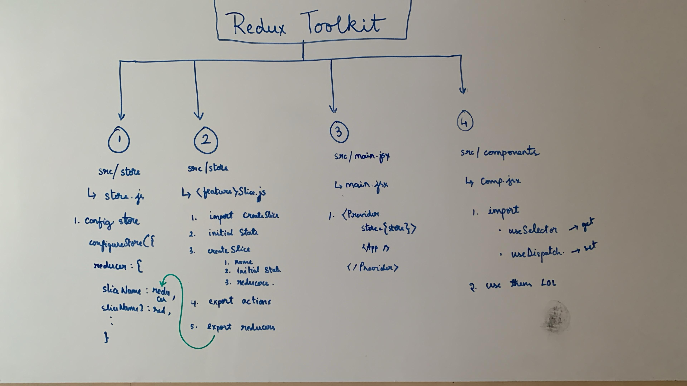

# Table-of-Contents

<!-- toc -->

- [Redux-Toolkit-RTK](#redux-toolkit-rtk)
  * [1.-Introduction-to-Redux-Toolkit-RTK](#1-introduction-to-redux-toolkit-rtk)
  * [2.-Why-Redux-Toolkit?](#2-why-redux-toolkit)
  * [3.-Core-APIs-and-Concepts](#3-core-apis-and-concepts)
    + [3.1.-configureStore()](#31-configurestore)
    + [3.2.-createSlice()](#32-createslice)
    + [3.3.-createAsyncThunk()](#33-createasyncthunk)
    + [3.4.-createEntityAdapter()](#34-createentityadapter)
  * [4.-Internal-Mechanics-&-How-RTK-Works](#4-internal-mechanics--how-rtk-works)
  * [5.-Best-Practices-with-Redux-Toolkit](#5-best-practices-with-redux-toolkit)
  * [6.-Performance-Considerations](#6-performance-considerations)
  * [7.-Common-Pitfalls](#7-common-pitfalls)
  * [8.-Practical-Code-Example:-Counter-with-Async-Increment](#8-practical-code-example-counter-with-async-increment)
  * [9.-Interview-Q&A:-Redux-Toolkit](#9-interview-qa-redux-toolkit)
    + [Q1.-What-is-Redux-Toolkit?-Why-use-it?](#q1-what-is-redux-toolkit-why-use-it)
    + [Q2.-How-does-createSlice()-simplify-Redux?](#q2-how-does-createslice-simplify-redux)
    + [Q3.-What-is-createAsyncThunk()?](#q3-what-is-createasyncthunk)
    + [Q4.-Why-should-you-normalize-your-state?-How-does-RTK-help?](#q4-why-should-you-normalize-your-state-how-does-rtk-help)
    + [Q5.-What-are-the-benefits-of-Immer-integration?](#q5-what-are-the-benefits-of-immer-integration)
    + [Q6.-How-do-you-configure-the-Redux-store-with-RTK?](#q6-how-do-you-configure-the-redux-store-with-rtk)
    + [Q7.-Can-you-customize-middleware-in-RTK?](#q7-can-you-customize-middleware-in-rtk)
    + [Q8.-What-are-common-mistakes-when-using-RTK?](#q8-what-are-common-mistakes-when-using-rtk)
  * [10.-Summary-Table](#10-summary-table)

<!-- tocstop -->

---
# Redux-Toolkit-RTK

## 1.-Introduction-to-Redux-Toolkit-RTK
RTK is the official, recommended, batteries-included toolset for Redux development.

It abstracts away boilerplate and complexity inherent in vanilla Redux.

RTK enables you to write Redux logic more efficiently, clearly, and with fewer mistakes.

It includes utilities for store setup, slices (reducers + actions), immutable update logic, and async handling.

## 2.-Why-Redux-Toolkit?
Vanilla Redux requires verbose boilerplate: action types, creators, reducers with switch statements.

Manual immutable updates can be error-prone.

RTK provides:
- `configureStore()` — simplified store setup with good defaults.
- `createSlice()` — automatic action types and reducers generation.
- `createAsyncThunk()` — standardized async thunk creation.
- `createEntityAdapter()` — normalized state helpers.
- Immer integration — allows writing “mutating” logic in reducers safely.
- Encourages best practices by default (e.g., redux-thunk included).

## 3.-Core-APIs-and-Concepts

### 3.1.-configureStore()
Simplifies store creation.

Automatically includes Redux DevTools extension and thunk middleware.

Accepts reducers and middleware overrides.

Example:
```js
import { configureStore } from '@reduxjs/toolkit';
import counterReducer from './counterSlice';

const store = configureStore({
  reducer: {
    counter: counterReducer,
  },
});

export default store;
````

### 3.2.-createSlice()

Core of RTK.

Defines slice name, initial state, and reducers (with action creators auto-generated).

Supports “mutating” syntax internally via Immer, producing immutable updates.

Example:

```js
import { createSlice } from '@reduxjs/toolkit';

const counterSlice = createSlice({
  name: 'counter',
  initialState: { value: 0 },
  reducers: {
    increment(state) {
      state.value += 1; // Immer handles immutability
    },
    decrement(state) {
      state.value -= 1;
    },
    incrementByAmount(state, action) {
      state.value += action.payload;
    },
  },
});

export const { increment, decrement, incrementByAmount } = counterSlice.actions;
export default counterSlice.reducer;
```

### 3.3.-createAsyncThunk()

Simplifies async actions and side-effects.

Handles promise lifecycle: pending, fulfilled, rejected.

Automatically generates action types.

Integrates with slice reducers via extraReducers.

Example:

```js
import { createAsyncThunk, createSlice } from '@reduxjs/toolkit';

export const fetchUserById = createAsyncThunk(
  'users/fetchByIdStatus',
  async (userId, thunkAPI) => {
    const response = await fetch(`/api/user/${userId}`);
    return response.json();
  }
);

const usersSlice = createSlice({
  name: 'users',
  initialState: { entities: {}, loading: 'idle' },
  reducers: {},
  extraReducers: (builder) => {
    builder
      .addCase(fetchUserById.pending, (state) => {
        state.loading = 'pending';
      })
      .addCase(fetchUserById.fulfilled, (state, action) => {
        state.loading = 'idle';
        state.entities[action.payload.id] = action.payload;
      })
      .addCase(fetchUserById.rejected, (state) => {
        state.loading = 'idle';
      });
  },
});

export default usersSlice.reducer;
```

### 3.4.-createEntityAdapter()

Utility for managing normalized collections.

Provides reducers and selectors for operations like add, update, remove.

Works with createSlice().

Example:

```js
import { createEntityAdapter, createSlice } from '@reduxjs/toolkit';

const usersAdapter = createEntityAdapter();

const usersSlice = createSlice({
  name: 'users',
  initialState: usersAdapter.getInitialState(),
  reducers: {
    addUser: usersAdapter.addOne,
    updateUser: usersAdapter.updateOne,
    removeUser: usersAdapter.removeOne,
  },
});

export const { addUser, updateUser, removeUser } = usersSlice.actions;
export default usersSlice.reducer;
```

## 4.-Internal-Mechanics-&-How-RTK-Works

- **Immer integration:** Allows writing mutable logic (state.value += 1), but produces immutable state updates behind the scenes.
    
- **Action creators:** Auto-generated from reducer names in `createSlice()` to avoid manual action type definition.
    
- **Thunk middleware:** RTK includes thunk by default to support async logic.
    
- **DevTools enabled by default:** `configureStore()` integrates Redux DevTools automatically with no extra config.
    

## 5.-Best-Practices-with-Redux-Toolkit

- Always use `createSlice()` instead of manual reducers and action creators.
    
- Use `createAsyncThunk()` for all async actions — keeps async code consistent and testable.
    
- Normalize state using `createEntityAdapter()` for lists/collections.
    
- Avoid directly mutating state outside of slices.
    
- Split slices logically per domain (user, posts, comments, etc.).
    
- Use selectors to encapsulate state shape.
    

## 6.-Performance-Considerations

- Immer overhead is minimal, but avoid unnecessary deep copies or large state mutations.
    
- Use selectors with memoization (`createSelector`) for expensive computations.
    
- Normalize large collections to prevent re-renders.
    
- Avoid putting non-serializable values in the store (functions, class instances).
    

## 7.-Common-Pitfalls

- Forgetting to export actions and reducer from slice correctly.
    
- Writing reducers without Immer-compatible logic in slices.
    
- Using manual thunk or async logic instead of `createAsyncThunk()`.
    
- Mutating state outside of `createSlice()` reducers.
    
- Not normalizing state leading to nested data mutation complexity.
    
- Passing non-serializable values into state causing Redux DevTools warnings.
    
- Overfetching data without caching or memoizing.
    

## 8.-Practical-Code-Example:-Counter-with-Async-Increment

```js
import { configureStore, createSlice, createAsyncThunk } from '@reduxjs/toolkit';

// Async thunk
export const incrementAsync = createAsyncThunk(
  'counter/incrementAsync',
  async (amount) => {
    return new Promise((resolve) => setTimeout(() => resolve(amount), 1000));
  }
);

// Slice
const counterSlice = createSlice({
  name: 'counter',
  initialState: { value: 0, status: 'idle' },
  reducers: {
    increment(state) {
      state.value++;
    },
  },
  extraReducers: (builder) => {
    builder
      .addCase(incrementAsync.pending, (state) => {
        state.status = 'loading';
      })
      .addCase(incrementAsync.fulfilled, (state, action) => {
        state.value += action.payload;
        state.status = 'idle';
      });
  },
});

export const { increment } = counterSlice.actions;

// Store
const store = configureStore({
  reducer: { counter: counterSlice.reducer },
});

export default store;
```

## 9.-Interview-Q&A:-Redux-Toolkit

### Q1.-What-is-Redux-Toolkit?-Why-use-it?

Redux Toolkit is the official Redux toolset that simplifies Redux development by reducing boilerplate, adding best practices, and including utilities like `createSlice`, `configureStore`, and `createAsyncThunk`.

### Q2.-How-does-createSlice()-simplify-Redux?

It automatically generates action creators and reducers from a single slice definition, and enables writing reducers with “mutable” syntax using Immer.

### Q3.-What-is-createAsyncThunk()?

A utility to create async thunk actions with automatic pending, fulfilled, and rejected action types, simplifying async state management.

### Q4.-Why-should-you-normalize-your-state?-How-does-RTK-help?

Normalization avoids deeply nested state mutations and improves performance. RTK’s `createEntityAdapter()` provides built-in normalized state helpers.

### Q5.-What-are-the-benefits-of-Immer-integration?

Allows writing simpler “mutable” logic while keeping state updates immutable under the hood, reducing errors and code verbosity.

### Q6.-How-do-you-configure-the-Redux-store-with-RTK?

Use `configureStore()` passing reducers object; it auto-adds middleware and DevTools.

### Q7.-Can-you-customize-middleware-in-RTK?

Yes, `configureStore()` allows middleware configuration and overriding defaults.

### Q8.-What-are-common-mistakes-when-using-RTK?

Not exporting actions/reducer properly, mutating state outside slices, neglecting normalization, and using manual thunk logic instead of `createAsyncThunk()`.

## 10.-Summary-Table

|API/Feature|Purpose|Notes|
|---|---|---|
|`configureStore`|Simplifies store setup|Auto adds thunk and DevTools|
|`createSlice`|Creates reducers + actions automatically|Uses Immer for mutable style|
|`createAsyncThunk`|Async thunk action creator|Handles lifecycle actions (pending/fulfilled/rejected)|
|`createEntityAdapter`|Normalized state management helpers|For managing collections (add/update/remove)|
|Immer integration|Enables mutable syntax with immutability|Reduces boilerplate and bugs|
|Middleware support|Built-in thunk, customizable|Supports adding middleware and enhancers|